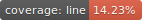

 

 
Line%20Coverage%20Status

 

for run printer in linux debian based run

### `sudo apt install libc6-dev`

### `sudo apt install libgdiplus`

build docker image

### `docker build . -f docker\Dockerfile --tag wagnerteixeira/systore-backend:latest`

tag docker image on windows

### `docker tag wagnerteixeira/systore-backend:latest wagnerteixeira/systore-backend:%date:~0,2%%date:~3,2%%date:~6,4%`

tag docker image on linux

### `docker tag wagnerteixeira/systore-backend:latest wagnerteixeira/systore-backend:$(date +%s)`

push docker image

### `docker push wagnerteixeira/systore-backend`

pull docker image

### `docker pull wagnerteixeira/systore-backend`

for run pass connectonstring

### `docker run -it -p 8085:80 --rm --name systoreapi -e ConnectionStrings__Systore="Server=host.docker.internal;User Id=root;Password=12345678;Database=systore" -e ConnectionStrings__SystoreAudit="Server=host.docker.internal;User Id=root;Password=12345678;Database=systoreAudit" wagnerteixeira/systore-backend`

for run detached

### `docker run -d -p 8085:80 --name systoreapi wagnerteixeira/systore-backend`

for run interative

### `docker run -it -p 8085:80 --name systoreapi wagnerteixeira/systore-backend`

stop container
docker stop systoreapi

remove container
docker stop systoreapi

start docker services detached
docker-compose up -d

stop docker services
docker-compose down

create network
docker network create --driver overlay systore_network

deploy stack
docker stack deploy -c docker-compose.yaml systoreapi

remove stack
docker stack rm systoreapi

docker run -it -p 3306:3300 --name mysql -e MYSQL_ROOT_PASSWORD=12345678 -v D:\mysql\data:/var/lib/mysql -d mysql/mysql-server:8.0

docker run -it -p 3306:3306 -p 33060:33060 --name mysql -e MYSQL_ROOT_PASSWORD=12345678 -e MYSQL_ROOT_HOST=% -v systore_db-data:/var/lib/mysql mysql/mysql-server:8.0

MYSQL_DATABASE=db
MYSQL_USERuser'
MYSQL_PASSWORD: 'pass'
MYSQL_ROOT_HOST=%

**SonarScanner with SonarCloud**

Install Sonnar Scanner Cli

### `dotnet tool install dotnet-sonarscanner --tool-path . --version 4.7.1`

initialize sonar

### `export SONAR_TOKEN=SONAR_TOKEN`

### `dotnet-sonarscanner begin /k:"wagnerteixeira_systore-backend" /n:"Systore backend" /o:"wagnerteixeira" /d:sonar.login=$SONAR_TOKEN /d:sonar.host.url=https://sonarcloud.io /d:sonar.cs.opencover.reportsPaths="./tests/TestResults/coverage.opencover.xml" /d:sonar.cs.vstest.reportsPaths="./tests/TestResults/*.trx"`

run tests

### `dotnet test --configuration Release /p:CollectCoverage=true /p:CoverletOutput=../TestResults/ /p:CoverletOutputFormat=\"opencover,lcov\" /p:Exclude="[Systore.Tests*]*" --logger trx --results-directory ./tests/TestResults/`

finalize and send report to SonarCloud

### `dotnet-sonarscanner end /d:sonar.login=$SONAR_TOKEN`

